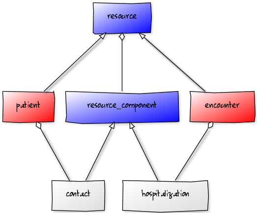

# FHIRbase

Open source relational storage for [FHIR](http://hl7.org/implement/standards/fhir/) with document API

[](https://travis-ci.org/fhirbase/fhirbase)


Powered by [Health Samurai](http://healthsamurai.github.io/)

Sponsored by:


## Live Demo

Here is an [interactive demo](http://try-fhirbase.hospital-systems.com)
where you can get some practice in preparing and executing arbitrary queries on a demo database.

## Motivation

While crafting Health IT systems you begin to understand a value of properly chosen domain model.
FHIR is an open source new generation lightweight standard for health data interoperability, which (we hope) could be used as an internal model for Health IT systems. FHIR is based on a concept of __resource__.


> FHIR® is a next generation standards framework created by HL7.
> FHIR combines the best features of HL7 Version 2,
> Version 3 and CDA® product lines while leveraging the latest
> web standards and applying a tight focus on implementability.

In terms of [Domain Driven Design](), __resource__ is an [aggregate]() which consists of a __root entity__
(having identity) and a set of aggregated __value objects__. In this readme we sometimes use DDD terminology
so don't be confused.

There is a concern - how to persist __resources__.

The simplest solution is just to save them as text blobs in RDBMS or in a distributed file storage system like (S3, Riak & Hadoop).
This solution is simple and scalable but has trade-offs:

* you will have to implement search and querying by creating hand-made indexes or using index engines like elastic search, solr, etc;
* query language will be very limited (in comparison with SQL);
* weak data consistency control - type checks, referential integrity, aggregate invariants;
* complicated batch transformations.

Second option is a usage of document databases like MongoDb, CouchDb, RethinkDb etc. They feat better (removing some part of hand work) but share some of trade-offs.

* Transaction consistency often works only on a document level granularity so you have to manage complex transactions manually.
* Querying is less powerful and declarative than for relational databases (joins, aggregations).
* Document databases sometimes are not yet really matured for enterprise (read mongo fails reports).

Third option - relational schema - solves most of the problems and brings new ones :)

* How to create such a complex schema?
* How to simplify aggregates (__resource__) operations (persistence, retrieval)?
* How to scale?

But we believe that after solving this problems we will get:

* fine-Granularity of data control;
* Rich Querying & Data Abstraction capabilities;
* Enhanced Data Consistency - applying most of FHIR constraints on a database level;
* storage Efficiency.

Most of it is required or desired while programming Health IT systems.

## Why postgresql?

> PostgreSQL is a powerful, open source object-relational database system.
> It has more than 15 years of active development and a proven architecture
> that has earned it a strong reputation for reliability, data integrity, and correctness.

We actively use advanced postgresql features

* [xml](http://www.postgresql.org/docs/9.3/static/functions-xml.html)
* [json](http://www.postgresql.org/docs/9.3/static/functions-json.html)
* [enums](http://www.postgresql.org/docs/9.3/static/datatype-enum.html)
* [arrays](http://www.postgresql.org/docs/9.3/static/arrays.html)
* [inheritance](http://www.postgresql.org/docs/9.3/static/tutorial-inheritance.html)
* [materialized views](http://www.postgresql.org/docs/9.3/static/sql-altermaterializedview.html)
* [pgtap](http://pgtap.org/)
* [uuid-ossp](http://www.postgresql.org/docs/9.3/static/uuid-ossp.html)


## Schema generation

We code-generate database schema & CRUD views & procedures from
FHIR machine readable specification (http://www.hl7.org/implement/standards/fhir/downloads.html).
All generation done in postgresql.

Generation steps:

* Convert FHIR meta specification from XML to more convenient relational form
* Generate schema using meta information
  * generate base tables - resource and resource_component
  * generate data types tables, inheriting from resource_component
  * generate enums for FHIR system enumerator types
  * generate tables for each resource
     * root entity table inherits from resource base table
     * components & complex type tables inherits from resource_component base table
* Generate views & procedures for CRUD
  * generate views, which return resource as json aggregate
  * generate insert_resource(resource json) - put resource data in
  * create delete procedure
  * create update procedure as delete & insert
* Run tests
* Dump resulting database as an end-user sql script

## Schema Overview

We heavily use postgresql inheritance for schema infrastructure.

There are two base tables:

* resource - base table for all __root entities__ of resources
* resource_component - base table for all __value objects__ (resource components)

Each resource represented as __root entity__ table (for example 'patient')
and table per component (for example: patient.contact is saved in `patient_contact` table).

This point is illustrated on picture bellow:



[edit](http://yuml.me/edit/1f3c8e92)

Due to inheritance we can access all resources throughout  __resource__ table
and all resource components by __resource_component__ table.


### Description of resource table

Base table for all resource aggregate root tables

```sql
  CREATE TABLE resource (
      id uuid NOT NULL, -- surrogate resource id
      _type varchar , -- real table name (i.e. where data are saved)
      _unknown_attributes json, -- json where all unknown attributes will be saved
      resource_type character varying, -- resourceType see FHIR documentation
      language character varying, -- see FHIR documentation
      container_id uuid, -- not null and references aggregating resource if resource is contained
      contained_id character varying -- original contained id from resource aggregate
  );
```

### Description resource_component table

Base table for all resource components

```sql
  CREATE TABLE resource_component (
      id uuid NOT NULL, -- surrogate component id
      _type character varying NOT NULL, -- real table name
      _unknown_attributes json, -- json where all unknown attributes will be saved
      parent_id uuid NOT NULL, -- reference to parent component if present
      resource_id uuid NOT NULL -- denormalized reference to resource root table, see explanations below
  );
```

### Primitive data types attributes

Here is mapping table for primitive types from FHIR to postgresql:

```sql

  CREATE TABLE type_to_pg_type (
      type character varying,
      pg_type character varying
  );

  COPY type_to_pg_type (type, pg_type) FROM stdin;
    code	varchar
    date_time	timestamp
    string	varchar
    text	text
    uri		varchar
    datetime	timestamp
    instant	timestamp
    boolean	boolean
    base64_binary	bytea
    integer	integer
    decimal	decimal
    sampled_data_data_type	text
    date	date
    id	varchar
    oid	varchar
  \.

```

### Enumerations

For FHIR system enumerated types we create postgresql ENUMs:

```sql

  CREATE TYPE "AddressUse" AS ENUM (
      'home',
      'work',
      'temp',
      'old'
  );

```

### Complex data type attributes

We create table for each compound data type,
inheriting from resource_component table.

Here is how table for address type created:

```sql

  CREATE TABLE address (
      use "AddressUse",
      text character varying,
      line character varying[],
      city character varying,
      state character varying,
      zip character varying,
      country character varying
  )
  INHERITS (resource_component);

```

For resource attributes with such compound type we create separate
tables (for the sake of separation of storage and consistency) and
inherits it from type base table:

```sql

  CREATE TABLE organization_address ()
  INHERITS (address);

```

### Tables abbreviations

Postgresql with default configuration limits length of table names.
We didn't want to rebuild postgresql so we shortened table names
using the following abbreviation table:


```sql

CREATE TABLE short_names (name varchar, alias varchar);
INSERT INTO short_names (name, alias)
VALUES
    ('capabilities', 'cap'),
    ('chanel', 'chnl'),
    ('codeable_concept', 'cc'),
    ('coding', 'cd'),
    ('identifier', 'idn'),
    ('immunization', 'imm'),
    ('immunization_recommendation', 'imm_rec'),
    ('location', 'loc'),
    ('medication', 'med'),
    ('medication_administration', 'med_adm'),
    ('medication_dispense', 'med_disp'),
    ('medication_prescription', 'med_prs'),
    ('medication_statement', 'med_st'),
    ('observation', 'obs'),
    ('prescription', 'prs'),
    ('recommendation', 'rcm'),
    ('resource_reference', 'res_ref'),
    ('value', 'val'),
    ('value_set', 'vs')
;

```

### Contained Resources

FHIR allows on level resource - resource aggregation,
see http://www.hl7.org/implement/standards/fhir/references.html.

We save __contained resources___ same way as resources, but 
in __container_id__ reference to parent resource, and preserve symbolic local resource id
in __contained_id__ field.

### Resource References

Now resource references are saved as other compound types, but we
are looking for a more relational solution for referential integrity
and reference traversing.

### Extensions

TODO: we are working on a solution

### views

Relational schema is perfect for querying.

Example - select patients with recent visits:

```sql

SELECT p.*
  FROM fhir.encounter_hospitalization_period ehp
    JOIN fhir.encounter_subject es
     ON es.resource_id = ehp.resource_id
    JOIN fhir.patient p
     ON p.id = es.reference::uuid
  WHERE  ehp.start BETWEEN LOCALTIMESTAMP - INTERVAL '1 week' AND LOCALTIMESTAMP

```

But after searching we want to get resource as whole
(i.e. collect resource aggregate from relational tables).

To simplify this, we generate views with names view_<resource_name>
which return FHIR compliant json resource representation. So to
accomplish query we can replace __patient__ table with __view_patient__ view,
and get resource json in one hop.


```sql

SELECT vp.id as id, vp.json as resource
  FROM fhir.encounter_hospitalization_period ehp
    JOIN fhir.encounter_subject es
     ON es.resource_id = ehp.resource_id
    JOIN fhir.view_patient vp
     ON vp.id = es.reference::uuid
  WHERE  ehp.start BETWEEN LOCALTIMESTAMP - INTERVAL '1 week' AND LOCALTIMESTAMP

```

### insert_resource(resource json)

Manually inserting resource aggregate into relations is also tricky.
To simplify this we generated procedure
`insert_resource(_resource json)` which puts resource components
into right relations and return new resource id (uuid).

### delete_resource(id uuid)

There are also procedures to delete resource

### update_resource(resource json)

Update resource is implemented as delete and insert with same id.

TODO: we should think about versioning!

## Installation

```bash

# Install postgresql-9.3 and postgresql-contrib
# if you use debian linux or ubuntu see dev/apt.postgresql.org.sh

# Create database
psql -d postgres -e 'create database mydb'`

# Download fhirbase.sql from repository backup and restore using psql
curl https://raw.github.com/fhirbase/fhirbase/master/fhirbase.sql | psql -d mydb

# check installation

psql -d mydb -e '\dt fhir.*'

# You can install checkout repository,
# install pgtap extension and run tests

git clone git@github.com:fhirbase/fhirbase.git
cd fhirbase
psql -d mydb < fhirbase_test.sql

```

## Usage

* all resource tables lay in __fhir__ schema
* insert_resource(res json) - store resource
* use SQL for querying (select, join, group)
* use resource views to retrieve json aggregates

## Contribution

* Star us on github
* Create an issue - for a bug report or enhancment
* Contribute to FHIRbase  - see dev/README.md

## Roadmap

* Extensions
* FHIR server implementation
* FHIR version migrations
* Oracle, MS SQL & Mysql support
